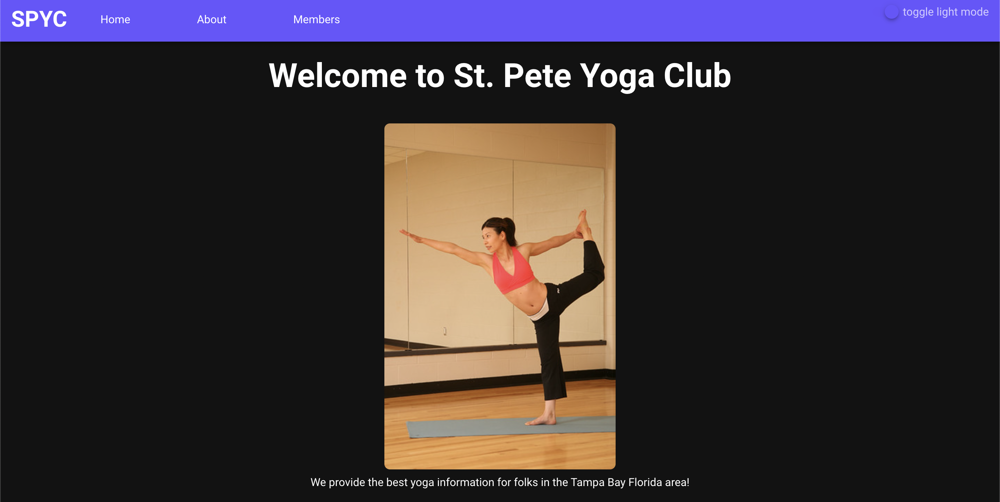
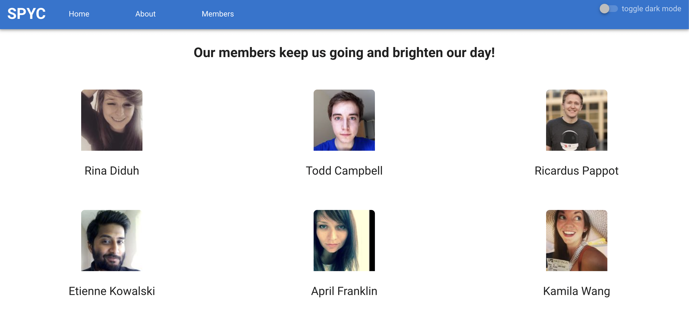
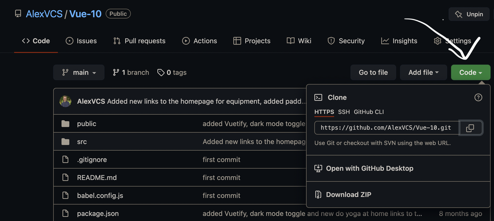

# St. Pete Yoga Club

A SPA showing a yoga club in the Tampa Bay area. Powered by Vue.

[Take a look at the yoga club](http://vue-10.vercel.app/) 🧘

## Table of Contents
* [Screenshots](#screenshots)
* [Setup](#setup)
* [Technologies](#technologies)
* [Attributions](#attributions)

### Screenshots

<p align="center">
    
</p>

<p align="center">
    
</p>

### Setup

Git and Yarn are required to run this project. Install Git by [following this](https://git-scm.com/book/en/v2/Getting-Started-Installing-Git). If you don't have Yarn installed please follow [these instructions](https://classic.yarnpkg.com/lang/en/docs/install/).

1. Click the green code button:



2. From there, click the button to the right of the URL under HTTPS. This will copy the URL of the repository.

3. Then open your terminal or command line. If you haven't used the command line before [learn how to here](https://www.theodinproject.com/lessons/foundations-command-line-basics).

4. If you've got a folder where you keep projects, change directories into that folder. After that type this command:

```git clone https://github.com/AlexVCS/Vue-10.git```

This clones the repository to your local machine. It has a root directory called `Vue-10` to store all the files.

5. Change directories into that folder:

```cd Vue-10```

After that you can open the project in your text editor of choice. I use Visual Studio Code and launch it from the command line. [Learn how here](https://code.visualstudio.com/docs/setup/mac).

6. Once you have the project open, you need to install the dependencies. Run this in your command line from the root (mad-libzz folder) of the project:

```yarn install```

7. After that finishes, run this to start the project:

```yarn serve```

8. Go to your browser and type in this address:

```http://localhost:8080/```

### Technologies

* [Vue](https://v2.vuejs.org/v2/guide/)
* CSS
* JavaScript

### Attributions

* [Random User Generator](https://randomuser.me/)